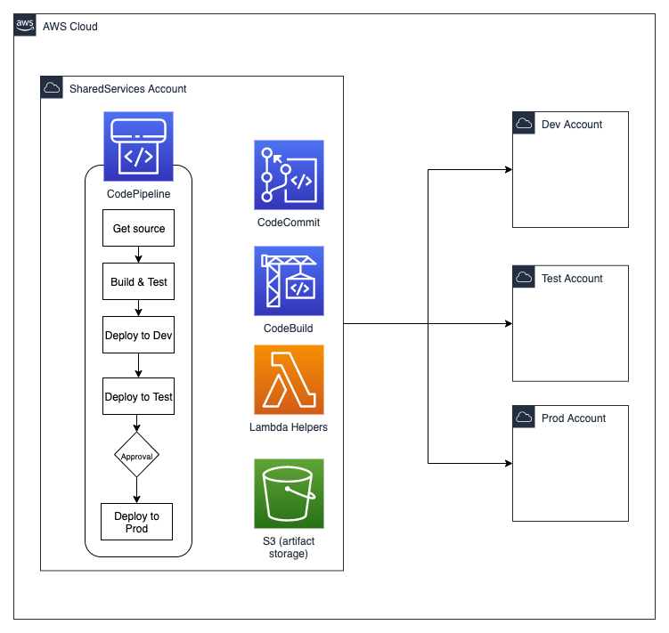

# AWS-Simple-CICD Project

This project provides a serverless CI/CD platform leveraging native AWS services provisioned using the AWS Cloud Development Kit (CDK). As per the AWS Well Architected Framework, this project assumes the use of multiple AWS accounts for secure isolation of environments.

This CI/CD platform is in use at a variety of AWS clients where the development teams are leveraging CloudFormation, Serverless Framework, AWS CDK and Terraform.

## Getting started

- [Pre-Requisites](docs/prereq.md)
- [Administrator Guide](docs/admin.md)
- [Developer Guide](docs/developer.md)

## Goals

- Pipelines as code.
- Bring Developers closer to their infrastructure and operations by providing a prescriptive platform.
- Support for (almost) any toolset the application developers want to use e.g. Terraform, CDK, Cloudformation, Pulumi etc.
- Minimize platform lock-in. Applications can be migrated to other CI/CD orchestration platform with minimal changes required by the developers.
- Enables "you build it, you run it".

## Features

- Cloud native and built on top of [AWS Serverless CI/CD tools](https://aws.amazon.com/serverless/developer-tools/)
- Runs on top of [AWS Landing Zone](https://aws.amazon.com/solutions/implementations/aws-landing-zone/)/[Control Tower](https://aws.amazon.com/controltower/)
- Supports pipeline notifications via [AWS SNS](https://aws.amazon.com/sns/)
- Supports branches (pipeline per branch)
- Auto-increments [semantic versioning](https://www.semver.org) per pipeline.

## Architecture

This is the pipeline that will be generated for each repository. The build and deployment stages in the pipeline execute a user defined shell script in an isolated docker container. The docker environment is provisioned on the fly by AWS CodeBuild.

The number of stages and their function is fully customizable e.g. adding a stage for security/vulnerability scanning, adding a stage for executing test cases etc.

### AWS services

- AWS CodeCommit (or any source control providor supported by CodePipeline)
- AWS CodePipeline
- AWS CodeBuild
- AWS Lambda
- AWS S3
- AWS SNS
- AWS CloudWatch
- AWS Systems Manager: Parameter Store
- AWS CloudFormation
