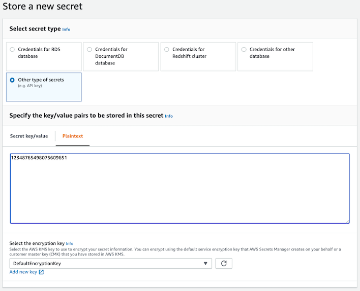

# Administrator Guide

These instructions are for the users who will be deploying and maintaining the platform.

0. [Setup project config](#setup-project-config)
1. [Configure accounts](#configure-accounts)
2. [Configure naming](#configure-naming)
3. [Configure pipelines](#configure-pipelines)
4. [Grouping pipelines](#grouping-pipelines)
5. [Overriding target environments](#overriding-target-environments)
6. [Deploying pipelines](#deploying-pipelines)

## Setup Project Config

Create a [project-config.json](../project-config.sample.json) file in the root of the Simple-CICD project. There is a sample ***project-config.sample.json*** file provided

## Configure Accounts

Add the account ids of the target accounts to the project-config.json file. The account Id will be passed to the deployment stage as an environment variable. Leave the account id blank (but do not remove the key e.g. dev, test, prod) for any environment you do not want to target.

```text
{
  dev: string,
  test: string,
  prod: string
}
```

Example:

```json
{
  "dev": "123456789000",
  "test": "123456789001",
  "prod": "123456789002"
}
```

### Deploy cross-account IAM role *(if needed)*

If you already have a cross-account role set up for deployments, then skip step 1.

#### Step 1

The pipelines will be deployed and executed in the Shared Services account. The pipeline will need to assume an IAM role in the target  accounts in order to provision resources.

A sample IAM role and profile is provided in this project if this does not already exist. Modify [deployment-role.yaml](../cross-account/deployment-role.yaml) based on your requirements and deploy it using the following commands. This role will need to be deployed to each target (dev, test and prod) AWS account.

```bash
cd cross-account

aws cloudformation deploy --template-file deployment-role.yaml --stack-name cicd-iam-stack --capabilities CAPABILITY_NAMED_IAM --parameter-overrides SharedAccountId={SHARED-ACCOUNT-ID}
```
Note: Replace {SHARED-ACCOUNT-ID} with the appropiate ID.

The IAM role name in the sample provided is ***deployment-role***.

#### Step 2

Set the cross-account role name in the [sample](../project-config.sample.json) file. Update ***cicdRoleName***. If you are using Github, set ***githubSecret*** to an AWS Secrets Manager secret storing the Github personal access token. (optional)

```bash
"deployment": {
    "region": "ca-central-1",
    "cicdRoleName": "deployment-role",
    "githubSecret": "github-token"
  },
```

## Configure Naming

All the AWS resources provisioned by this project will follow a standard naming convention. This can be configured as desired.

```text
{
  company: string,
  dept: string,
  project: string
}
```

Example:

This will generate resources prefixed with ***acme-markets-roadrunner***

```json
{
  "company": "acme",
  "dept": "markets",
  "project":  "roadrunner"
}
```

## Configure Pipelines

- The pipeline name and branch are concatenated to create a unique pipeline per branch.
- The sample provides a single TriggerType - CodeCommit. This can be extended to add Github, BitBucket etc.
- An SNS Topic is generated for the pipeline. Subscribers receive notifications on status of each pipeline stage. Emails are sent by a Lambda function.
- A Parameter Store parameter is generated which stores the semantic version and automatically increments (uses python semver library) on every successful build.
- A Cron parameter can be set to trigger the pipeline on a schedule managed by CloudWatch. (optional)

```text
{
  pipelineName: string,
  ccRepoName: string,
  branch: string,
  type: TriggerType,
  cron: string,
}
```

### GitHub Example

**Note** GitHub integration uses personal access tokens. See: [https://docs.github.com/en/github/authenticating-to-github/creating-a-personal-access-token](https://docs.github.com/en/github/authenticating-to-github/creating-a-personal-access-token)

In AWS Secrets Manager create a plain text secret where the value is your Github personal access token. In this example the secret is called ***github-token***




This sample will generate a pipeline called ***acme-markets-roadrunner-infra-eks-main***

```json
    {
      "pipelineName": "infra-eks",
      "repository": "acme-infra-eks",
      "branch": "main",
      "type": "GitHub",
      "owner": "owner",
    }
```

### CodeCommit Example

This sample will generate a pipeline called ***acme-markets-roadrunner-rocket-powered-skates-master***

```json
{
  "pipelineName": "rocket-powered-skates",
  "ccRepoName": "rocket-powered-skates",
  "branch": "master",
  "type": "CodeCommit",
}
```

## Grouping Pipelines

AWS CloudFormation has a limit of 500 resources per stack. To bypass this limitation we recommend grouping pipelines together and generating a separate stack for each group. In the [sample](../project-config.sample.json) the pipelines are grouped by team, Team One and Team Two.

### Adding a new group

1. Create a new array in project-config.json for Team Three. See teamOne or teamTwo for an example.

    ```bash
    "teamThree": [
      {
        "pipelineName": "rocket-powered-skates",
        "ccRepoName": "rocket-powered-skates",
        "branch": "master",
        "type": "CodeCommit",
        "cron": ""
      }
    ]
    ```

1. Update [config.ts](../config/config.ts) and update the ProjectConfig interface by exporting the configuration for Team Three.

    ```bash
      teamThree:  Array<ProjectRepo>
    ```

1. Update [cicd.ts](../bin/cicd.ts) to generate a new stack for Team Three.

    ```bash
      new CicdStack(app, 'AWS-Simple-CICD-TeamThree', { prefix, ssmRoot, repos: config.teamThree})
    ```  

Group your pipelines based on your needs. Grouping by teams is just provided as an example.

## Overriding target environments

In some situations you may want to pick and choose which target environments the pipeline should deploy to. For example when you want to build a feature branch you do not want it to deployed to production. In this situation you can set the targets array to override the default behavior where every pipeline pushes all the way to production.

```json
{
  "pipelineName": "rocket-powered-skates",
  "ccRepoName": "rocket-powered-skates",
  "branch": "feature/ticket-1234",
  "type": "Github",
  "owner": "Owner",
  "targets": ["dev", "test"]
}
```

## Deploying Pipelines

If you have not installed AWS CDK already please refer to the [pre-requisites](./prereq.md)

```bash
npm install

npm run build

# The bootstrap only needs to be executed once
cdk bootstrap --profile <shared services account profile>

cdk deploy --all --profile <shared services account profile>
```
